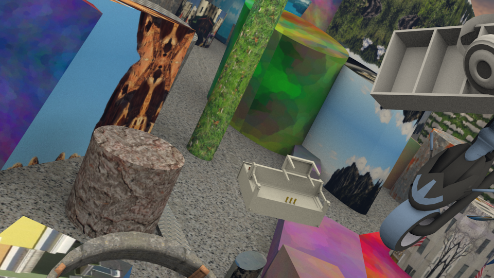
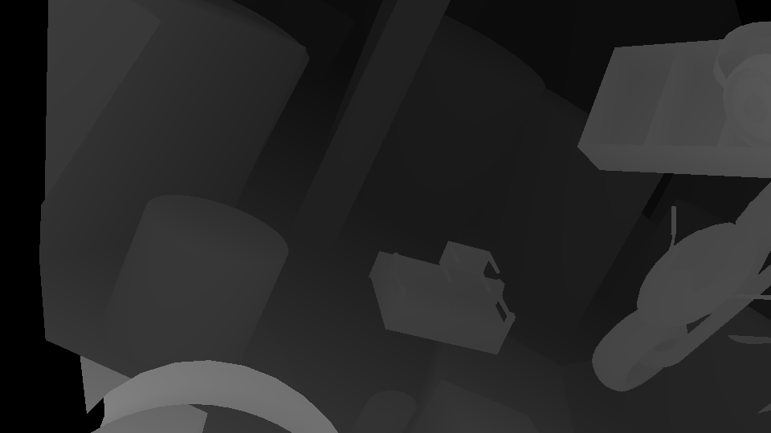
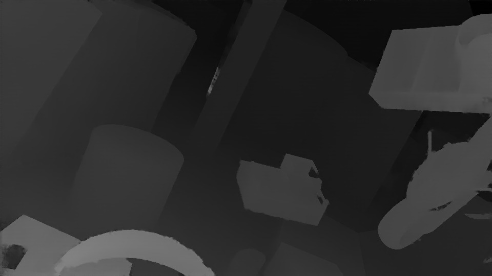

# Full resolution in Stereo Matching

Due to the limitation of the computational resource, CNN based Stereo Matching often needs to downsample the input stereo pairs. However, as a relatively low-level task, Stereo Matching needs to output the disparity with the same size as its input images. This is the full resolution problem.

In experiments, I reproduced some others work, [PSMNet][] and [StereoNet](#references). Codes in PSMNet-FRR are partly based on the [PSMNet][] repository. Codes in StereoNet-SRR are written by myself.

## Requirements

* Python 3.6
* PyTorch 0.4.0

## Demos

**
Image
**

**
Groundtruth Disparity
**

**
Prediction Disparity
**

---

## References

* Khamis S, Fanello S R, Rhemann C, et al. StereoNet: Guided Hierarchical Refinement for Real-Time Edge-Aware Depth Prediction[C]. european conference on computer vision, 2018: 596-613.
* Chang J, Chen Y. Pyramid Stereo Matching Network[C]. computer vision and pattern recognition, 2018: 5410-5418.

[PSMNet]: https://github.com/JiaRenChang/PSMNet
